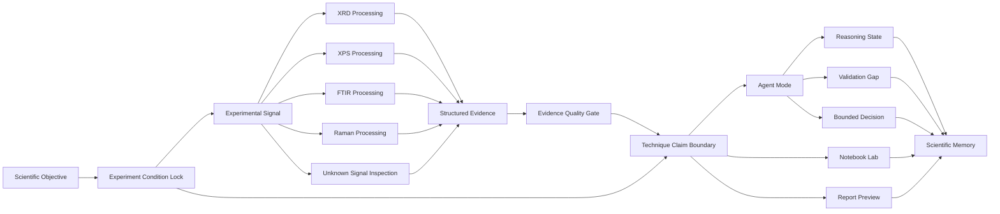

# DIFARYX

> **From experimental evidence to bounded, validated scientific decisions.**

DIFARYX is an agentic scientific workspace that turns experimental characterization signals into evidence-linked reasoning, bounded decisions, and report-ready scientific outputs.

The current repository is a deterministic frontend demo for materials-characterization workflows. It includes an XRD workspace, a multi-technique workspace, Agent Mode, Notebook Lab, History, Settings, New Experiment condition locking, and a public-beta uploaded-signal workflow for XRD, XPS, FTIR, and Raman.

DIFARYX was built for **OpenAI Build Week** using **Codex with GPT-5.6**.

## Track

**Work and Productivity**

DIFARYX helps scientific and R&D teams move more efficiently from instrument output to reviewable evidence, validation gaps, scientific decisions, notebook discussions, and report sections.

---

## Project Overview

Scientific characterization does not end when a graph is generated.

Researchers must still determine:

- what was directly observed,
- what processing was applied,
- which interpretation is supported,
- what evidence is missing,
- whether different analytical techniques agree,
- what claims are scientifically defensible,
- and what should happen next.

DIFARYX structures this process as an evidence-first workflow:

$$
\text{Signal}
\rightarrow
\text{Compute}
\rightarrow
\text{Reason}
\rightarrow
\text{Validate}
\rightarrow
\text{Decide}
\rightarrow
\text{Report}
$$

Rather than sending raw signals directly to an AI model and requesting a conclusion, DIFARYX first constructs a bounded scientific context containing:

- experimental provenance,
- locked measurement conditions,
- processing parameters,
- extracted signal features,
- evidence quality,
- technique-specific limitations,
- and permitted claim boundaries.

This context can then be handed to an agent, notebook, or report surface without losing the connection between evidence and conclusion.

---

## Why This Matters

Scientific teams often move from raw instrument output to discussion text through fragmented manual steps.

Common problems include:

- Experimental data is distributed across files, instruments, spreadsheets, and technique-specific software.
- Interpretation often requires manual comparison across XRD, XPS, FTIR, Raman, and supporting scientific context.
- Traceability from signal feature to claim, limitation, and report text is weak.
- Measurement and processing conditions are frequently separated from the conclusion they produced.
- AI-generated scientific text can overstate what the available evidence supports.
- Moving from processing result to notebook discussion or report section is slow and inconsistent.
- Different reviewers may apply different standards to the same evidence.

DIFARYX focuses on the gap between **signal inspection** and **defensible scientific decisions**.

Each signal-derived observation is treated as structured evidence with:

- provenance,
- evidence quality,
- experimental context,
- processing context,
- uncertainty,
- validation state,
- and an explicit claim boundary.

---

## Core Scientific Workflow

### Primary reviewer story

```text
Signal
  -> Compute
  -> Reason
  -> Literature / Validation
  -> Decision
  -> Report
```

### Current internal handoff model

```text
ProcessingResult
  -> AgentDiscussionRefinement
  -> NotebookEntry
  -> ReportSection
```

### Reproducibility-aware handoff

```text
Locked Scientific Context
  + Experiment Condition Lock
  -> Evidence Quality Gate
  -> Claim Boundary
  -> Agent / Notebook / Report
```

The current demo uses deterministic local logic for:

- signal parsing,
- signal processing,
- feature extraction,
- reasoning states,
- evidence-quality gates,
- claim-boundary generation,
- Notebook previews,
- and report handoff.

The literature and validation stage is currently represented through bounded workflow language and validation-pending claim boundaries.

Live literature retrieval, production reference matching, backend validation services, and live model inference are future integration points.

---

# How Codex and GPT-5.6 Were Used

Codex with GPT-5.6 was used as the primary engineering environment for building, auditing, testing, and refining DIFARYX.

The model was not used merely to generate isolated code snippets. It was used as a repository-level engineering collaborator across architecture, implementation, debugging, scientific workflow design, test coverage, and documentation.

## 1. Repository Understanding

Codex was used to inspect and reason across the existing DIFARYX codebase, including relationships between:

- React routes,
- workspace components,
- scientific evidence schemas,
- local persistence,
- runtime modes,
- uploaded-signal workflows,
- Notebook and report handoffs,
- experiment condition records,
- and technique-specific analysis surfaces.

This was particularly important because DIFARYX contains several related but distinct concepts:

- demo versus user workspace behavior,
- bundled evidence versus uploaded evidence,
- scientific context versus experiment conditions,
- processing results versus interpretations,
- and deterministic demo behavior versus future agent integrations.

Codex helped trace these concepts across the repository instead of treating each file independently.

## 2. Product and Workflow Architecture

Codex with GPT-5.6 helped define and refine the scientific workflow:

```text
Evidence
  -> Processing
  -> Observation
  -> Reasoning
  -> Validation Gap
  -> Decision
  -> Scientific Memory
```

It was also used to design the boundaries between:

- deterministic numerical processing,
- agent reasoning,
- validation status,
- claim permissions,
- Notebook discussion,
- and report generation.

This separation is important because numerical signal processing should not be replaced by language-model estimation.

## 3. Multi-Technique Upload Workflow

Codex assisted with the public-beta uploaded-signal workflow for:

- XRD,
- XPS,
- FTIR,
- Raman,
- and unknown signal inspection.

Development work included:

- parsing delimited numeric files,
- detecting usable numeric columns,
- allowing X/Y remapping,
- detecting or selecting the analytical technique,
- extracting technique-specific signal features,
- handling malformed input,
- storing compact uploaded runs in local browser storage,
- and preventing uploaded evidence from inheriting assumptions from bundled demo projects.

## 4. Experiment Condition Lock

Codex helped implement the New Experiment condition-locking model and propagate locked conditions across:

- Dashboard experiment cards,
- the multi-technique upload workspace,
- Agent Mode,
- Notebook Lab,
- and Notebook export previews.

The implementation preserves incomplete fields rather than silently inferring or deleting them.

It also converts missing conditions into conservative scientific limitations such as:

- measurement-limited,
- method-limited,
- validation-pending,
- or publication-level claims blocked.

## 5. Scientific Guardrail Design

GPT-5.6 was used through Codex to help formalize scientific guardrails, including:

- separation of direct observation from interpretation,
- technique-specific claim boundaries,
- prevention of unsupported material identity inference,
- validation requirements before stronger claims,
- conservative language for weak or incomplete evidence,
- and blocking report-ready states for invalid uploads.

The goal was not to make the demo produce the strongest possible conclusion. The goal was to make it produce the strongest conclusion that the available evidence can defensibly support.

## 6. Debugging and Refactoring

Codex was used to investigate issues spanning multiple modules, such as:

- state not persisting after refresh,
- malformed localStorage records,
- stale storage keys,
- runtime-context mismatches,
- demo evidence leaking into uploaded-run output,
- inconsistent readiness states,
- frontend contract mismatches,
- and incorrect report or agent handoff conditions.

This repository-level debugging was one of the most valuable uses of Codex.

## 7. Testing

Codex assisted with the upload-beta smoke-test design and implementation.

The current test workflow validates:

- valid CSV parsing,
- numeric X/Y extraction,
- technique assignment,
- X/Y column remapping,
- bounded XRD claim generation,
- invalid-file handling,
- persistence limits,
- signal compaction,
- corrupted localStorage recovery,
- and forbidden scientific wording.

## 8. Documentation

Codex was also used to create and improve:

- implementation plans,
- workflow descriptions,
- architecture notes,
- scientific evidence contracts,
- condition-lock specifications,
- guardrail language,
- reviewer documentation,
- and this README.

---

## Important Runtime Disclosure

The current DIFARYX repository does **not** execute GPT-5.6 as a live scientific inference backend.

Codex with GPT-5.6 was used to build and refine the project, while the reviewer-facing demo currently uses deterministic local logic so that the workflow can be replayed consistently without:

- production authentication,
- cloud storage,
- an external model API,
- licensed scientific databases,
- or a live backend service.

Agent Mode demonstrates the intended scientific-agent interaction model through deterministic execution states, evidence panels, reasoning steps, validation boundaries, and decision outputs.

A future production version can replace or extend selected deterministic reasoning stages with live model execution while retaining the same evidence contracts and scientific guardrails.

---

## Current Demo Routes

| Route | What reviewers should see |
| --- | --- |
| `/` | Public DIFARYX concept page and scientific workflow story. |
| `/dashboard` | Product overview with demo projects, readiness, graph previews, Agent Mode entry points, and New Experiment creation. |
| `/workspace` | Workspace entry surface that routes reviewers into technique review. |
| `/workspace/xrd` | XRD graph review, processing controls, feature detection, evidence saving, and exports. |
| `/workspace/multi` | Multi-technique evidence hub, public-beta uploaded-signal workflow, and condition-lock handoff framing. |
| `/workspace/xps` | XPS-focused evidence review surface. |
| `/workspace/ftir` | FTIR-focused evidence review surface. |
| `/workspace/raman` | Raman-focused evidence review surface. |
| `/demo/agent` | Deterministic Agent Mode with goal, graph, execution log, evidence, reasoning, validation, and decision. |
| `/notebook` | Notebook Lab with evidence summary, caveats, provenance, condition context, and report/export preview. |
| `/history` | Deterministic run history and workspace provenance. |
| `/settings` | Local demo settings for profile, data handling, export, and reasoning preferences. |

---

# Multi-Technique Public Beta Upload Core

The `/workspace/multi` route supports local uploaded-signal workflows for:

- XRD,
- XPS,
- FTIR,
- Raman,
- and unknown signal inspection.

## Supported File Types

- `.csv`
- `.txt`
- `.xy`
- `.dat`

## Upload Workflow

```text
Upload signal
  -> Select or detect technique
  -> Map columns
  -> Confirm scientific context
  -> Lock context
  -> Plot signal
  -> Extract technique-specific features
  -> Run evidence quality gate
  -> Generate claim boundary
  -> Send bounded result to Agent / Notebook / Report
```

The upload beta accepts:

- comma-delimited data,
- tab-delimited data,
- semicolon-delimited data,
- and whitespace-delimited numeric data.

It ignores:

- empty lines,
- nonnumeric header rows,
- and nonnumeric comment lines.

By default, the first numeric column is mapped to X and the second numeric column to Y. Users can remap the columns before analysis.

---

## Local Persistence

Uploaded runs are stored only in the browser under:

```text
difaryx.uploadedSignalRuns.v1
```

This occurs only when `localStorage` is available.

For demo safety:

- saved runs are capped,
- stored signal arrays are compacted,
- malformed saved records are handled safely,
- and the upload workflow remains usable in memory when persistence is unavailable.

Supporting uploads do not silently inherit:

- synthesis conditions,
- measurement conditions,
- processing conditions,
- validation conditions,
- sample identity,
- or material assumptions.

When an uploaded run is tied to a current experiment, DIFARYX displays the available condition lock and keeps the condition boundary visible during handoff.

---

# Experiment Condition Lock

The New Experiment flow treats experiment conditions as a first-class locked scientific record.

Users can enter and lock the following categories.

## Sample Preparation Conditions

- synthesis method,
- precursor ratio,
- solvent,
- pH,
- synthesis temperature,
- synthesis duration,
- calcination temperature,
- calcination duration,
- atmosphere,
- and post-treatment.

## Measurement Conditions

- instrument,
- radiation or source,
- scan range,
- step size,
- scan rate,
- calibration reference,
- and acquisition mode.

## Processing Conditions

- baseline correction,
- smoothing,
- normalization,
- peak detection,
- fitting model,
- and reference database.

## Validation Conditions

- replicate requirement,
- reference-validation requirement,
- cross-technique validation,
- refinement requirement,
- and whether publication-level claims are permitted after validation.

When the user selects **Lock experiment conditions**, DIFARYX creates a local timestamped condition record associated with the experiment.

Missing non-critical fields remain explicitly incomplete. They are not erased, fabricated, or silently inferred.

The locked record then appears in:

- Dashboard experiment cards,
- `/workspace/multi`,
- Agent Mode,
- Notebook Lab,
- and Notebook export previews.

---

## Condition-Lock Effects

Condition locks are intentionally conservative.

- Incomplete measurement conditions mark interpretation as **measurement-limited**.
- Incomplete processing conditions mark output as **method-limited**.
- Missing or restrictive validation conditions block publication-level claims.
- Refinement requirements block phase-purity claims until refinement evidence is attached.
- Required cross-technique evidence blocks related claims until the required evidence is attached.
- Missing calibration or reference information remains visible as a validation gap.

---

# Technique-Specific Claim Boundaries

| Technique | Evidence role | Scientific boundary |
| --- | --- | --- |
| **XRD** | Crystal-structure and phase evidence | Supports phase-evidence review, but does not make a phase-purity claim without reference validation and required refinement. |
| **XPS** | Surface composition and oxidation-state evidence | Surface-sensitive evidence only; it cannot establish bulk composition or bulk phase identity alone. |
| **FTIR** | Bonding, functional-group, and support evidence | Provides qualitative bonding and functional-group context, not a standalone structural assignment. |
| **Raman** | Vibrational fingerprint and local-structure evidence | Supports local vibrational or structural consistency, but does not replace crystallographic assignment. |
| **Unknown** | Generic signal inspection | Supports feature inspection only; no material-specific scientific claim is generated. |

These boundaries are carried into Agent, Notebook, and Report handoff surfaces.

---

# Scientific Guardrails

DIFARYX applies the following rules throughout the demo:

- Uploaded runs remain separate from bundled CuFe₂O₄ demo evidence.
- Sample identity is not inferred without user-confirmed context.
- User-confirmed source context is treated as a locked scientific constraint.
- Experiment conditions are treated as locked reproducibility constraints.
- Evidence-quality gates run before interpretation handoff.
- Claim boundaries are generated before Notebook or Report preview.
- Condition boundaries are shown before Notebook or Report preview when a condition record exists or is pending.
- Weak or unsupported uploads produce a bounded blocked state instead of material-specific interpretation.
- Invalid uploads cannot become ready for agent or report handoff.
- Missing conditions remain visible as missing.
- Cross-technique agreement is not assumed merely because multiple files exist.
- A plausible explanation is not automatically treated as a validated conclusion.

Preferred output language includes:

- `supports`,
- `is consistent with`,
- `suggests`,
- `requires validation`,
- `evidence-limited`,
- `measurement-limited`,
- `method-limited`,
- `context-confirmed`,
- `reference validation pending`,
- and `cannot establish`.

The upload beta does not use:

- live backend storage,
- live GPT-5.6 execution,
- Google Scholar scraping,
- licensed scientific reference databases,
- or production-grade reference matching.

---

# Agent Mode

The `/demo/agent` route demonstrates how a future scientific agent can coordinate a bounded review.

The current deterministic Agent Mode includes:

- a scientific objective,
- selected evidence,
- experiment-condition context,
- an execution graph,
- an execution log,
- evidence-quality state,
- reasoning stages,
- validation gaps,
- claim boundaries,
- and a bounded decision.

The design separates:

1. **What was observed**
2. **What was computed**
3. **What can be inferred**
4. **What remains uncertain**
5. **What requires validation**
6. **What action should occur next**

This structure is intended to prevent an agent from turning incomplete evidence into unsupported certainty.

---

# Notebook and Report Handoff

Notebook and report surfaces receive structured, bounded context rather than raw, untracked conclusions.

For uploaded signals, the handoff preview includes:

- file name,
- analytical technique,
- user-confirmed sample identity,
- locked scientific context,
- experiment-condition status,
- extracted features,
- evidence quality,
- claim boundary,
- limitations,
- and validation requirements.

The current upload handoff is intentionally preview-based.

It packages upload-derived evidence for the existing Notebook and Report workflow without mixing that evidence into canonical bundled demo projects.

---

# Deterministic Demo Disclosure

This repository is a frontend demonstration.

It uses deterministic local logic and bundled data so reviewers can replay the same workflow without requiring:

- a production backend,
- authentication,
- cloud storage,
- paid model calls,
- external scientific APIs,
- or licensed reference databases.

The public-beta upload workflow is browser-scoped.

It demonstrates:

- parsing,
- column mapping,
- plotting,
- feature extraction,
- evidence-quality gating,
- condition boundaries,
- claim boundaries,
- and Notebook or Report handoff context.

It does not currently perform:

- live literature validation,
- production scientific reference matching,
- live GPT-5.6 scientific inference,
- or automated publication-level verification.

---

# System Architecture



---

# Technology Stack

## Current Demo

- React
- TypeScript
- Vite
- Tailwind CSS
- Browser `localStorage`
- Deterministic local processing and workflow logic
- Bundled scientific demo data
- Local uploaded-signal parsing
- Mermaid documentation diagrams

## Development

- Codex
- GPT-5.6
- Repository-level code analysis
- Assisted implementation and refactoring
- Test and smoke-test generation
- Scientific workflow and guardrail design
- Architecture and documentation support

## Future Production Path

Potential future integrations include:

- OpenAI model execution for bounded evidence review,
- tool-based scientific agents,
- structured model outputs,
- MCP-compatible scientific tools,
- backend signal-processing services,
- cloud object storage,
- literature and internal-knowledge retrieval,
- reference-database integrations,
- ELN and LIMS integrations,
- and organization-scoped scientific memory.

Additional architecture paths may include:

- Cloud Run for analysis services,
- Vertex AI Search for retrieval over literature, SOPs, notebooks, and validated knowledge,
- Gemini for selected bounded reasoning workflows,
- ADK-style agent orchestration,
- and MCP-style interfaces for inspectable scientific capabilities.

These are future architecture paths and are not required for the current deterministic demo.

---

# Run Locally

Install dependencies:

```powershell
npm.cmd install
```

Start the local Vite application:

```powershell
npm.cmd run dev
```

Build the production bundle:

```powershell
npm.cmd run build
```

Run the upload-beta smoke test:

```powershell
npm.cmd run smoke:upload-beta
```

Check diff hygiene:

```powershell
git diff --check
```

---

# Upload Beta Smoke Test

The following command:

```powershell
npm.cmd run smoke:upload-beta
```

runs:

```text
test-upload-beta.mjs
```

The smoke test validates:

- valid CSV fixture parsing,
- numeric X/Y array extraction,
- XRD technique assignment,
- X/Y column mapping,
- feature extraction after remapping,
- bounded XRD claim generation,
- no CuFe₂O₄ demo-assumption injection,
- safe invalid-file handling,
- no ready-for-agent state for invalid evidence,
- no report-ready state for invalid evidence,
- persistence capped at eight saved runs,
- persisted signals capped at 1,200 points,
- corrupted `localStorage` handling,
- and forbidden scientific wording guardrails.

---

# Challenges

## Integrating Multiple Analytical Techniques

Each technique has different:

- file structures,
- axis conventions,
- units,
- preprocessing requirements,
- feature semantics,
- evidence roles,
- and validation standards.

DIFARYX needed a common workflow without erasing technique-specific scientific meaning.

## Preserving Scientific Context

A signal without measurement and processing conditions can be misleading.

The system therefore needed to carry context from experiment creation through processing, reasoning, Notebook entry, and report preview.

## Preventing Unsupported Conclusions

A key challenge was preventing plausible scientific language from being mistaken for validated evidence.

The system needed to distinguish:

- observation,
- computation,
- interpretation,
- assumption,
- uncertainty,
- validation gap,
- and decision.

## Keeping Uploaded Evidence Separate

User-uploaded evidence must not inherit the identity, references, or conclusions of bundled demo projects.

Maintaining this boundary required explicit storage, state, wording, and handoff controls.

## Designing a Replayable Demo

The project needed to demonstrate agentic scientific workflows while remaining stable and reproducible for reviewers.

This led to the decision to use deterministic local logic rather than an unreliable or unavailable production backend.

## Balancing Scientific Detail and Interface Clarity

Scientific workflows can become dense quickly.

The interface must expose processing parameters, evidence quality, provenance, and validation limitations without overwhelming the reviewer.

---

# What We Learned

## Better Models Are Not Enough

Scientific AI requires more than capable language models.

It also requires:

- evidence contracts,
- provenance,
- experimental conditions,
- processing metadata,
- quality gates,
- claim boundaries,
- and transparent uncertainty.

## Numerical Processing and Language Reasoning Should Be Separated

Signal processing should remain deterministic and inspectable.

Language models should reason over structured evidence rather than estimate numerical results from screenshots or raw text alone.

## An Agent Must Be Able to Stop

In scientific work, identifying insufficient evidence can be more valuable than producing a confident answer.

A useful scientific agent must be able to say:

- the evidence is incomplete,
- the method is insufficiently documented,
- validation is pending,
- or the proposed claim cannot yet be established.

## Scientific Memory Is More Than Chat History

A reusable scientific record should preserve:

- the objective,
- experimental conditions,
- processing decisions,
- evidence,
- limitations,
- reasoning,
- validation status,
- and final decision.

## Codex Is Most Valuable at Repository Level

Codex with GPT-5.6 was most effective when used to understand interactions between architecture, code, tests, scientific semantics, and documentation—not merely to generate individual functions.

## Guardrails Should Be Part of the Data Model

Scientific caution should not exist only in prompt wording.

It should be represented structurally through:

- evidence-quality fields,
- condition status,
- validation requirements,
- blocked states,
- and claim-boundary objects.

---

# Current Status

The current DIFARYX demo includes:

- a scientific agent workspace,
- XRD review and processing controls,
- multi-technique file management,
- XPS, FTIR, and Raman workspace routes,
- uploaded-signal parsing,
- technique detection and selection,
- X/Y column mapping,
- signal visualization,
- technique-specific feature extraction,
- evidence-quality gates,
- experiment condition locking,
- deterministic Agent Mode,
- structured Notebook handoff,
- report preview,
- run history,
- local settings,
- and scientific wording guardrails.

---

# Roadmap

Planned improvements include:

- live GPT-5.6 evidence-review workflows,
- structured model outputs tied to evidence identifiers,
- stronger reference-database integration,
- literature-grounded validation,
- richer uncertainty models,
- multi-technique contradiction detection,
- collaborative scientific review,
- versioned scientific decisions,
- reproducibility packages,
- experiment recommendation workflows,
- publication-readiness checks,
- ELN integrations,
- LIMS integrations,
- organization-level scientific memory,
- and secure backend persistence.

---

# Reviewer Notes

- DIFARYX is a scientific reasoning and workflow platform, not an XRD-only analyzer.
- Codex with GPT-5.6 was used to build, analyze, debug, test, and document the project.
- The current reviewer-facing demo is deterministic and frontend-only.
- Agent Mode currently demonstrates the intended scientific-agent workflow without live model inference.
- The public-beta upload workflow is local-browser scoped.
- Uploaded evidence remains separate from bundled demonstration evidence.
- Scientific outputs are bounded by evidence quality, experiment conditions, technique limitations, and validation requirements.
- Stronger scientific claims remain blocked until the required evidence is attached.

---

# Responsible Use

DIFARYX is designed to support scientific review and workflow organization.

It is not a replacement for qualified scientific judgment.

Users should independently verify:

- signal-processing parameters,
- peak assignments,
- reference matches,
- chemical-state assignments,
- structural interpretations,
- model-generated reasoning,
- and experimental recommendations.

Final scientific conclusions remain the responsibility of the researcher or research team.

---

# Built for OpenAI Build Week

DIFARYX demonstrates how **Codex with GPT-5.6** can support the full lifecycle of a scientific productivity product:

- understanding an existing repository,
- refining product architecture,
- implementing multi-surface workflows,
- debugging cross-module state,
- designing scientific guardrails,
- building tests,
- and documenting the resulting system.

The project also establishes a structured foundation for future GPT-5.6-powered scientific agents that reason over bounded, provenance-linked experimental evidence rather than producing untracked scientific text.

---

## License

This project is licensed under the MIT License.
